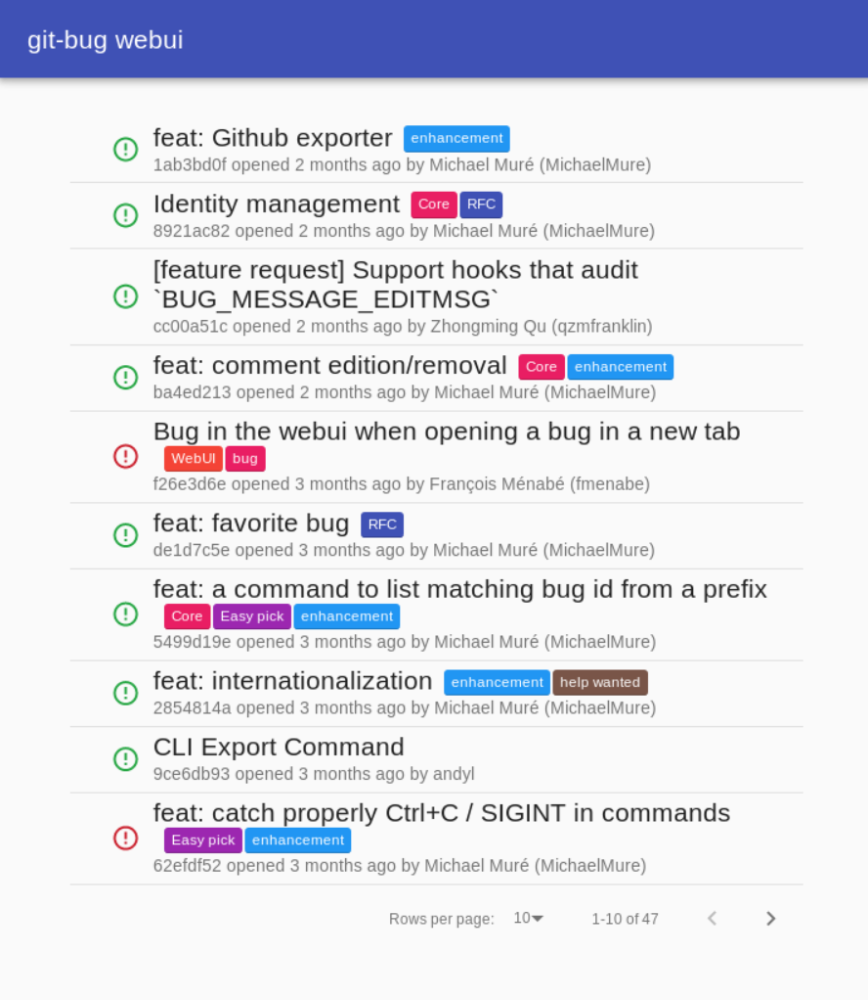
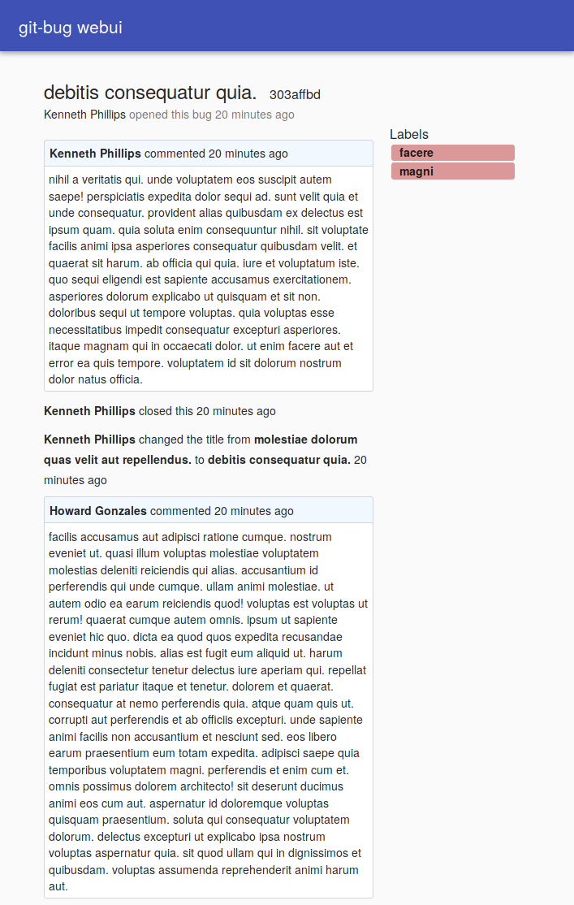

<h1 align="center">git-bug</h1>

<div align="center">

Distributed bug tracker embedded in Git.

[](https://travis-ci.org/MichaelMure/git-bug)
[](http://www.gnu.org/licenses/gpl-3.0)
[](https://godoc.org/github.com/MichaelMure/git-bug)
[](https://goreportcard.com/report/github.com/MichaelMure/git-bug)
[](https://gitter.im/the-git-bug/Lobby)

</div>

Would it be nice to not have to rely on a web service somewhere to deal with bugs ?

Would it be nice to be able to browse and edit bug reports offline?

`git-bug` is a distributed bug tracker embedded in `git`. It uses git's internal storage so **no files are added in your project**.

As you would do with commits and branches, you can push your bugs to the same git remote you are already using to collaborate with other people.

:construction: This is for now a proof of concept. Expect dragons and unfinished business. :construction:

## Install

### Go get
```shell
go get github.com/MichaelMure/git-bug
```

If it's not done already, add golang binary directory in your PATH:

```bash
export PATH=$PATH:$GOROOT/bin:$GOPATH/bin
```
### Pre-compiled binaries

1. Go to the [release page](https://github.com/MichaelMure/git-bug/releases/latest) and download the appropriate binary for your system.
2. Copy the binary anywhere in your PATH
3. Rename the binary to `git-bug` (or `git-bug.exe` on windows)

That's all !

### Linux packages

* [Archlinux (AUR)](https://aur.archlinux.org/packages/?K=git-bug)

## CLI usage

Create a new bug:

```
git bug new
```

Your favorite editor will open to write a title and a message.

You can push your new entry to a remote:
```
git bug push [<remote>]
```

And pull for updates:
```
git bug pull [<remote>]
```

List existing bugs:
```
git bug ls
```

You can now use commands like `show`, `comment`, `open` or `close` to display and modify bugs. For more details about each command, you can run `git bug <command> --help` or read the [command's documentation](doc/md/git-bug.md).

## Interactive terminal UI

An interactive terminal UI is available using the command `git bug termui` to browse and edit bugs.

<p align="center">
    
</p>

## Web UI (status: WIP)

You can launch a rich Web UI with `git bug webui`.




This web UI is entirely packed inside the same go binary and serve static content through a localhost http server.

The web UI interact with the backend through a GraphQL API. The schema is available [here](graphql/schema.graphql).

## Internals

Interested by how it works ? Have a look at the [data model](doc/model.md).

## Misc

- [Bash completion](misc/bash_completion)
- [Zsh completion](misc/zsh_completion)
- [ManPages](doc/man)

## Planned features

- media embedding
- import/export of github issue
- extendable data model to support arbitrary bug tracker
- inflatable raptor

## Contribute

PRs accepted. Drop by the [Gitter lobby](https://gitter.im/the-git-bug/Lobby) for a chat.

## License

GPLv3 or later © Michael Muré
