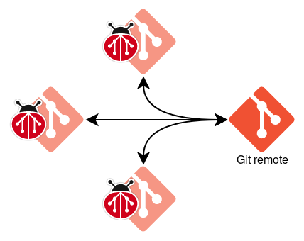
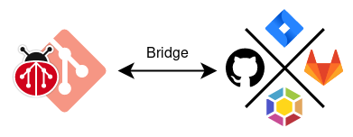
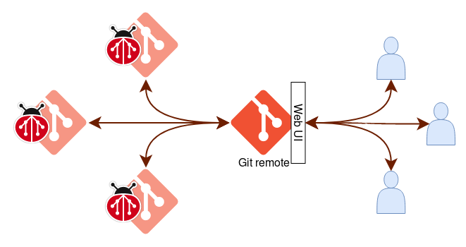
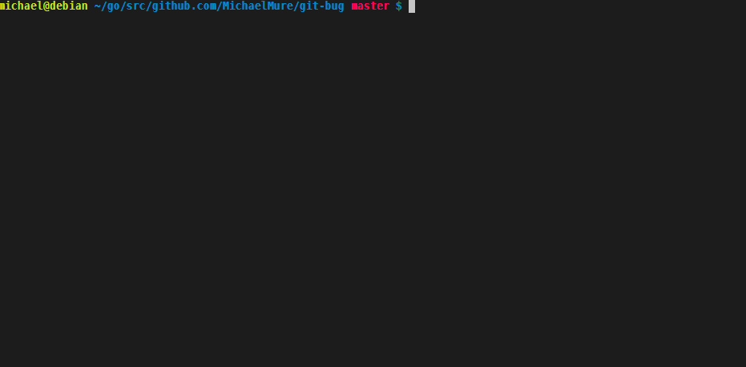
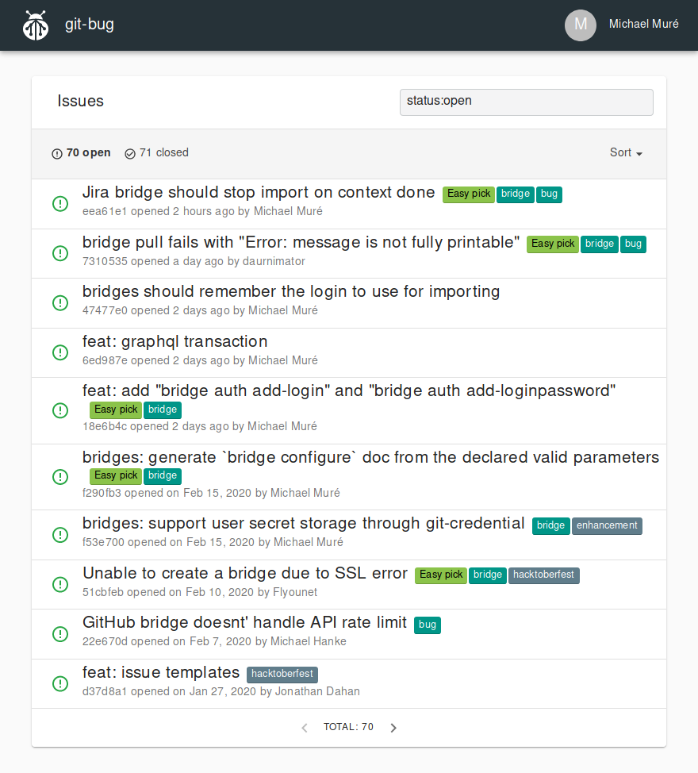
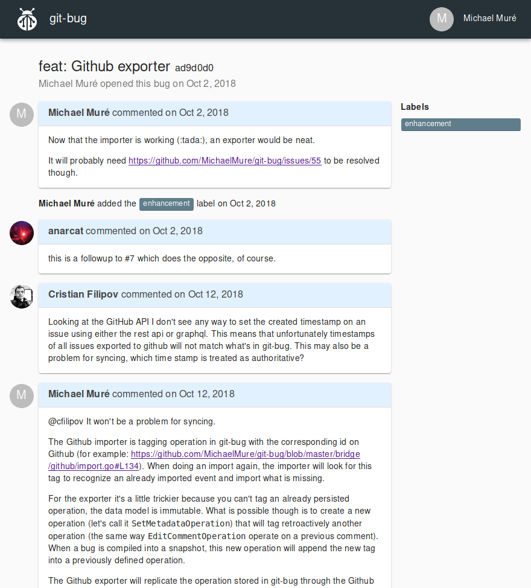

<p align="center">
    
</p>
<h1 align="center">git-bug</h1>

<div align="center">

[](https://travis-ci.com/MichaelMure/git-bug)
[](#backers)
[](#sponsors)
[](http://www.gnu.org/licenses/gpl-3.0)
[](https://godoc.org/github.com/MichaelMure/git-bug)
[](https://goreportcard.com/report/github.com/MichaelMure/git-bug)
[](https://gitter.im/the-git-bug/Lobby)

</div>

`git-bug` is a bug tracker that:

- **is fully embedded in git**: you only need your git repository to have a bug tracker
- **is distributed**: use your normal git remote to collaborate, push and pull your bugs!
- **works offline**: in a plane or under the sea? Keep reading and writing bugs!
- **prevents vendor lock-in**: your usual service is down or went bad? You already have a full backup.
- **is fast**: listing bugs or opening them is a matter of milliseconds
- **doesn't pollute your project**: no files are added in your project
- **integrates with your tooling**: use the UI you like (CLI, terminal, web) or integrate with your existing tools through the CLI or the GraphQL API
- **bridges to other bug trackers**: use [bridges](#bridges) to import and export to other trackers.

:construction: This is now more than a proof of concept, but still not fully stable. Expect dragons and unfinished business. :construction:

## Help needed!

This project has grown bigger than I can handle by myself, especially with a day job. I'm looking for people to help on or maintain part of it:
- each bridges (go)
- the terminal UI (go)
- the web UI (Typescript/React/GraphQL)

Individually, those pieces are not especially complex but doing everything make it hard for me to focus on the core where things get more complicated. If this is useful for you or you just want to join the fun, maybe consider it?

## Installation

<details><summary>Pre-compiled binaries</summary>

1. Go to the [release page](https://github.com/MichaelMure/git-bug/releases/latest) and download the appropriate binary for your system.
2. Copy the binary anywhere in your $PATH
3. Rename the binary to `git-bug` (or `git-bug.exe` on windows)

That's all !

</details>

<details><summary>Linux packages</summary>

* [Archlinux (AUR)](https://aur.archlinux.org/packages/?K=git-bug)
* [NixOS](https://github.com/NixOS/nixpkgs/blob/master/pkgs/applications/version-management/git-and-tools/git-bug/default.nix#L31)

</details>

<details><summary>macOS packages</summary>

* [Homebrew](https://formulae.brew.sh/formula/git-bug)
  ```
  brew install git-bug
  ```

</details>

<details><summary>FreeBSD package/port</summary>

Install via the package manager
  ```
  pkg install git-bug
  ```

Or from the ports collection
  ```
  cd /usr/ports/devel/git-bug && make install clean
  ```

</details>

<details><summary>Compile from git (unstable)</summary>

```shell
git clone git@github.com:MichaelMure/git-bug.git
make install
```

If it's not done already, add the golang binary directory in your PATH:

```bash
export PATH=$PATH:$(go env GOROOT)/bin:$(go env GOPATH)/bin
```

</details>

## Workflows

There are multiple ways to use `git-bug`:

<details><summary>Native workflow</summary>
<p align="center">
    
</p>

This is the pure `git-bug` experience. In a similar fashion as with code, use `git bug push` and `git bug pull` to push and pull your bugs between git remotes and collaborate with your teammate. 

</details>

<details><summary>Bridge workflow</summary>
<p align="center">
    
</p>

As `git-bug` has bridges with other bug-trackers, you can use it as your personal local remote interface. Sync with `git bug bridge pull` and `git bug bridge push`, work from your terminal, integrate into your editor, it's up to you. And it works offline !

</details>

<details><summary>Web UI workflow (WIP)</summary>
<p align="center">
    
</p>

Often, projects needs to have their bug-tracker public and accept editions from anyone facing a problem. To support this workflow, `git-bug` aims to have the web UI accept external OAuth authentication and act as a public portal. However the web UI is not up to speed for that yet. Contribution are very much welcome!

</details>

## CLI usage

Create a new identity:

```
git bug user create
```

Create a new bug:

```
git bug add
```

Your favorite editor will open to write a title and a message.

You can push your new entry to a remote:
```
git bug push [<remote>]
```

And pull for updates:
```
git bug pull [<remote>]
```

List existing bugs:
```
git bug ls
```

Filter and sort bugs using a [query](doc/queries.md):
```
git bug ls "status:open sort:edit"
```

Search for bugs by text content:
```
git bug ls "foo bar" baz
```

You can now use commands like `show`, `comment`, `open` or `close` to display and modify bugs. For more details about each command, you can run `git bug <command> --help` or read the [command's documentation](doc/md/git-bug.md).

## Interactive terminal UI

An interactive terminal UI is available using the command `git bug termui` to browse and edit bugs.



## Web UI (status: WIP)

You can launch a rich Web UI with `git bug webui`.

<p align="center">
  
</p>

<p align="center">
  
</p>

This web UI is entirely packed inside the same go binary and serve static content through a localhost http server.

The web UI interact with the backend through a GraphQL API. The schema is available [here](api/graphql/schema).

## Bridges

### Importer implementations

|                                                 | Github             | Gitlab             | Jira               | Launchpad          |
|-------------------------------------------------|:------------------:|:------------------:|:------------------:|:------------------:|
| **incremental**<br/>(can import more than once) | :heavy_check_mark: | :heavy_check_mark: | :heavy_check_mark: | :x:                |
| **with resume**<br/>(download only new data)    | :heavy_check_mark: | :heavy_check_mark: | :heavy_check_mark: | :x:                |
| **identities**                                  | :heavy_check_mark: | :heavy_check_mark: | :heavy_check_mark: | :heavy_check_mark: |
| identities update                               | :x:                | :x:                | :x:                | :x:                |
| **bug**                                         | :heavy_check_mark: | :heavy_check_mark: | :heavy_check_mark: | :heavy_check_mark: |
| comments                                        | :heavy_check_mark: | :heavy_check_mark: | :heavy_check_mark: | :heavy_check_mark: |
| comment editions                                | :heavy_check_mark: | :x:                | :heavy_check_mark: | :x:                |
| labels                                          | :heavy_check_mark: | :heavy_check_mark: | :heavy_check_mark: | :x:                |
| status                                          | :heavy_check_mark: | :heavy_check_mark: | :heavy_check_mark: | :x:                |
| title edition                                   | :heavy_check_mark: | :heavy_check_mark: | :heavy_check_mark: | :x:                |
| **media/files**                                 | :x:                | :x:                | :x:                | :x:                |
| **automated test suite**                        | :heavy_check_mark: | :heavy_check_mark: | :x:                | :x:                |

### Exporter implementations

|                          | Github             | Gitlab             | Jira               | Launchpad |
|--------------------------|:------------------:|:------------------:|:------------------:|:---------:|
| **bug**                  | :heavy_check_mark: | :heavy_check_mark: | :heavy_check_mark: | :x:       |
| comments                 | :heavy_check_mark: | :heavy_check_mark: | :heavy_check_mark: | :x:       |
| comment editions         | :heavy_check_mark: | :heavy_check_mark: | :heavy_check_mark: | :x:       |
| labels                   | :heavy_check_mark: | :heavy_check_mark: | :heavy_check_mark: | :x:       |
| status                   | :heavy_check_mark: | :heavy_check_mark: | :heavy_check_mark: | :x:       |
| title edition            | :heavy_check_mark: | :heavy_check_mark: | :heavy_check_mark: | :x:       |
| **automated test suite** | :heavy_check_mark: | :heavy_check_mark: | :x:                | :x:       |

#### Bridge usage

Interactively configure a new github bridge:

```bash
git bug bridge configure
```

Or manually:

```bash
git bug bridge configure \
    --name=<bridge> \
    --target=github \
    --url=https://github.com/MichaelMure/git-bug \
    --login=<login>
    --token=<token>
```

Import bugs:

```bash
git bug bridge pull [<name>]
```

Export modifications:

```bash
git bug bridge push [<name>]
```

Deleting a bridge:

```bash
git bug bridge rm [<name>]
```

## Internals

Interested by how it works ? Have a look at the [data model](doc/model.md) and the [internal bird-view](doc/architecture.md).

## Misc

- [Bash completion](misc/bash_completion)
- [Zsh completion](misc/zsh_completion)
- [PowerShell completion](misc/powershell_completion)
- [ManPages](doc/man)

## Planned features

- media embedding
- more bridges
- extendable data model to support arbitrary bug tracker
- inflatable raptor

## Contribute

PRs accepted. Drop by the [Gitter lobby](https://gitter.im/the-git-bug/Lobby) for a chat or browse the issues to see what is worked on or discussed.

```shell
git clone git@github.com:MichaelMure/git-bug.git
```

You can now run `make` to build the project, or `make install` to install the binary in `$GOPATH/bin/`.

To work on the web UI, have a look at [the dedicated Readme.](webui/Readme.md)


## Contributors :heart:

This project exists thanks to all the people who contribute.
<a href="https://github.com/MichaelMure/git-bug/graphs/contributors"></a>


## Backers

Thank you to all our backers! 🙏 [[Become a backer](https://opencollective.com/git-bug#backer)]

<a href="https://opencollective.com/git-bug#backers" target="_blank"></a>


## Sponsors

Support this project by becoming a sponsor. Your logo will show up here with a link to your website. [[Become a sponsor](https://opencollective.com/git-bug#sponsor)]

<a href="https://opencollective.com/git-bug/sponsor/0/website" target="_blank"></a>
<a href="https://opencollective.com/git-bug/sponsor/1/website" target="_blank"></a>
<a href="https://opencollective.com/git-bug/sponsor/2/website" target="_blank"></a>
<a href="https://opencollective.com/git-bug/sponsor/3/website" target="_blank"></a>
<a href="https://opencollective.com/git-bug/sponsor/4/website" target="_blank"></a>
<a href="https://opencollective.com/git-bug/sponsor/5/website" target="_blank"></a>
<a href="https://opencollective.com/git-bug/sponsor/6/website" target="_blank"></a>
<a href="https://opencollective.com/git-bug/sponsor/7/website" target="_blank"></a>
<a href="https://opencollective.com/git-bug/sponsor/8/website" target="_blank"></a>
<a href="https://opencollective.com/git-bug/sponsor/9/website" target="_blank"></a>


## License

Unless otherwise stated, this project is released under the [GPLv3](LICENSE) or later license © Michael Muré.

The git-bug logo by [Viktor Teplov](https://github.com/vandesign) is released under the [Creative Commons Attribution 4.0 International (CC BY 4.0)](misc/logo/LICENSE) license © Viktor Teplov.
