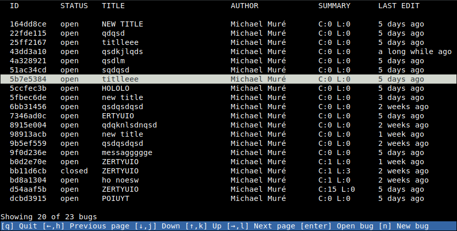
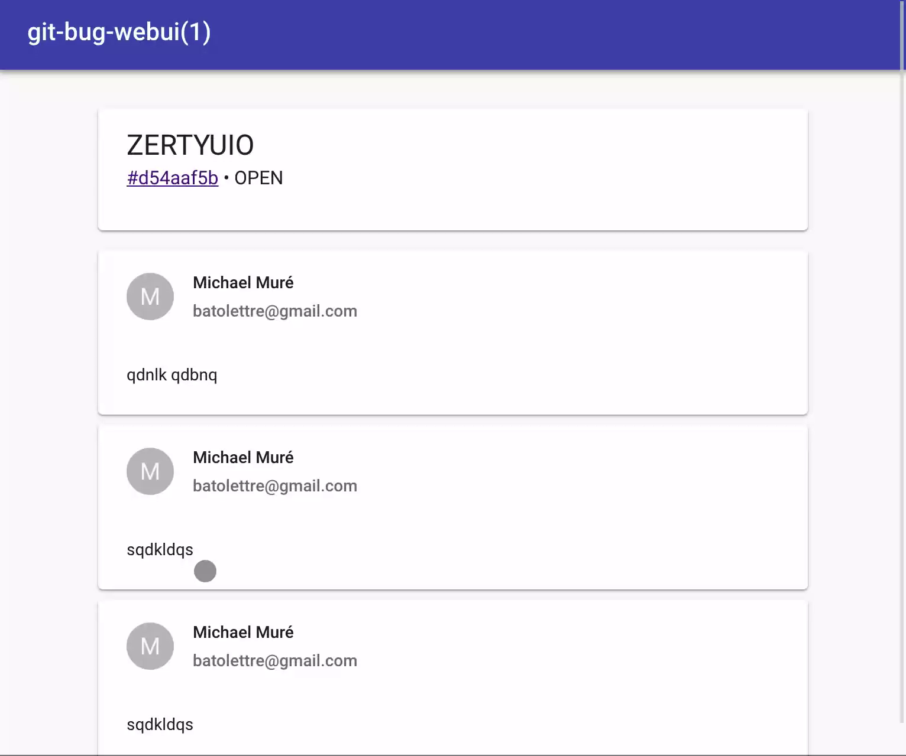

# git-bug

[](https://travis-ci.org/MichaelMure/git-bug)
[](http://www.gnu.org/licenses/gpl-3.0)
[](https://godoc.org/github.com/MichaelMure/git-bug)

> Bugtracker embedded in Git

Would it be nice to not have to rely on a web service somewhere to deal with bugs ?

Would it be nice to be able to browse and edit bug report offline ?

`git-bug` is a bugtracker embedded in `git`. It use git's internal storage so **no files are added in your project**.

As you would do with commits and branches, you can push your bugs to the same git remote your are already using to collaborate with other peoples. 

:construction: This is for now a proof of concept. Expect dragons and unfinished business. :construction:

## Install

```shell
go get github.com/MichaelMure/git-bug
```

If it's not done already, add golang binary directory in your PATH:

```bash
export PATH=$PATH:$GOROOT/bin:$GOPATH/bin
```

That's all ! In the future, pre-compiled binary will be provided for convenience.

## CLI usage

Create a new bug:

```
git bug new
```

Your favorite editor will open to write a title and a message.

You can push your new entry to a remote:
```
git bug push [<remote>]
```

And pull for updates:
```
git bug pull [<remote>]
```

List existing bugs:
```
git bug ls
```

You can now use commands like `show`, `comment`, `open` or `close` to display and modify bugs. For more details about each command, you can run `git bug <command> --help` or read the [command's documentation](doc/md/git-bug.md).

## Interactive terminal UI

An interactive (WIP) terminal UI is available using the command `git bug termui` to browse and edit bugs.



// TODO: replace with less test data ;-)

## Web UI

You can launch a rich Web UI (terribly WIP) with `git bug webui`.



This web UI is entirely packed inside the same go binary and serve static content through a localhost http server.

The web UI interact with the backend through a GraphQL API. The schema is available [here](graphql/schema.graphql).

Note: the compiled web UI is not commited in git for now so you will have to install npm packages and build it before compiling the go binary.

## Internals

Interested by how it works ? Have a look at the [data model](doc/model.md).

## Misc

- [Bash completion](misc/bash_completion)
- [Zsh completion](misc/zsh_completion)
- [ManPages](doc/man)

## Planned features

- [ ] interactive CLI UI
- [ ] rich web UI
- [ ] media embedding
- [ ] import/export of github issue
- [ ] inflatable raptor

## Contribute

PRs accepted.

## License


GPLv3 or later © Michael Muré
