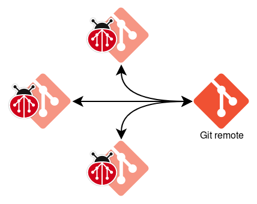
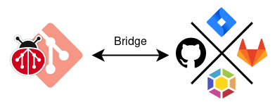
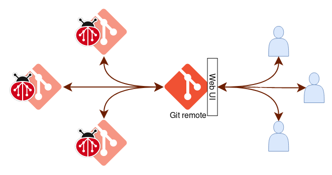
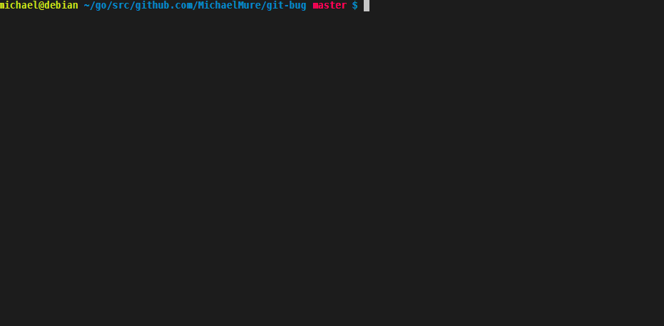
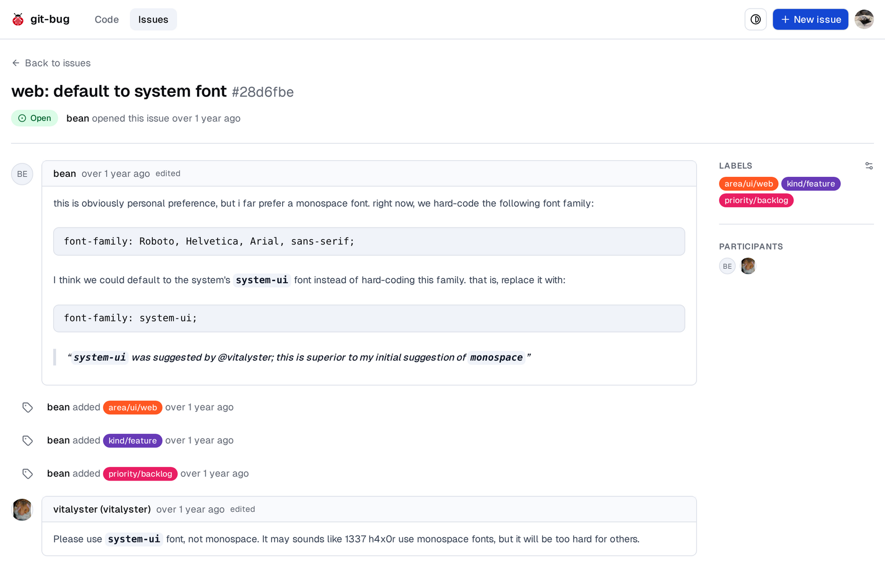
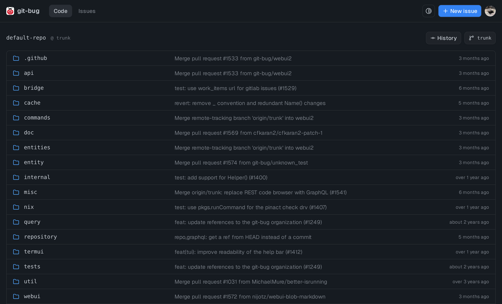

<div align="center">


# git-bug

[![Build Status][ci/badge]][ci/url]
[![Backers on Open Collective][backers/badge]][oc]
[![Sponsors on Open Collective][sponsors/badge]][oc]
[![GPL v3 License][license/badge]][license/url]
[![GoDoc][godoc/badge]][godoc/url]
[![Go Report Card][report-card/badge]][report-card/url]
[![Matrix][matrix/badge]][matrix/url]

[Issues] - [Documentation][doc] - [Discussions][discuss]

</div>

`git-bug` is a bug tracker that:

- **is fully embedded in git**: you only need your git repository to have a bug tracker
- **is distributed**: use your normal git remote to collaborate, push and pull your bugs!
- **works offline**: in a plane or under the sea? Keep reading and writing bugs!
- **prevents vendor lock-in**: your usual service is down or went bad? You already have a full backup.
- **is fast**: listing bugs or opening them is a matter of milliseconds
- **doesn't pollute your project**: no files are added in your project
- **integrates with your tooling**: use the UI you like (CLI, terminal, web) or integrate with your existing tools through the CLI or the GraphQL API
- **bridges to other bug trackers**: use [bridges](#bridges) to import and export to other trackers.

## Installation

See [`INSTALLATION.md`][doc/install] for the complete guide, including how to build from source and verify your install.

## Workflows

There are multiple ways to use `git-bug`. See [the workflow documentation][doc/usage/workflows] for the details.

<details><summary>Native workflow</summary>
<p align="center">
    
</p>

This is the pure `git-bug` experience. In a similar fashion as with code, use `git bug push` and `git bug pull` to push and pull your bugs between git remotes and collaborate with your teammate.

</details>

<details><summary>Bridge workflow</summary>
<p align="center">
    
</p>

As `git-bug` has bridges with other bug-trackers, you can use it as your personal local remote interface. Sync with `git bug bridge pull` and `git bug bridge push`, work from your terminal, integrate into your editor, it's up to you. And it works offline!

</details>

<details><summary>Web UI workflow (WIP)</summary>
<p align="center">
    
</p>

Often, projects need to have their bug-tracker public and accept editions from anyone facing a problem. To support this workflow, `git-bug` aims to have the web UI accept external OAuth authentication and act as a public portal. However the web UI is not up to speed for that yet. Contributions are very much welcome!

</details>

## CLI usage

Create a new identity:

```shell
git bug user create
```

Create a new bug:

```shell
git bug add
```

Your favorite editor will open to write a title and a message.

You can push your new entry to a remote:

```shell
git bug push [<remote>]
```

And pull for updates:

```shell
git bug pull [<remote>]
```

List existing bugs:

```shell
git bug ls
```

Filter and sort bugs using a [query][doc/usage/query]:

```shell
git bug ls "status:open sort:edit"
```

Search for bugs by text content:

```shell
git bug ls "foo bar" baz
```

You can now use commands like `show`, `comment`, `open` or `close` to display and modify bugs. For more details about each command, you can run `git bug <command> --help` or read the [command's documentation][doc/cli].

## Interactive terminal UI

An interactive terminal UI is available using the command `git bug termui` to browse and edit bugs.



## Web UI

You can launch a rich Web UI with `git bug webui`. Browse, search and filter issues, open new ones, comment, and edit titles, labels and status. It also doubles as a code browser for your repository, with a file tree, syntax-highlighted files, commit history and diffs.

<p align="center">
  
</p>

<p align="center">
  
</p>

The web UI is packed inside the same go binary and served by a local http server. It talks to the backend through a GraphQL API, whose schema is available [here][gql-schema].

## Bridges

`git-bug` can import from and export to Github, Gitlab, Jira and Launchpad. See the [feature matrix][doc/feature-matrix] for what each bridge supports, and the [bridge documentation][doc/usage/bridges] for the full guide.

Interactively configure a new bridge:

```shell
git bug bridge new
```

Or manually:

```shell
git bug bridge new \
    --name=<bridge> \
    --target=github \
    --url=https://github.com/git-bug/git-bug \
    --login=<login> \
    --token=<token>
```

Import bugs:

```shell
git bug bridge pull [<name>]
```

Export modifications:

```shell
git bug bridge push [<name>]
```

Delete a bridge:

```shell
git bug bridge rm [<name>]
```

## Internals

Interested in how it works? Have a look at the [data model][doc/design/model] and the [internal bird-view][doc/design/arch].

The on-disk format is formally specified in the [git-bug spec][spec], covering the DAG entity format, identities and the bug entity. Read that if you want to write another implementation or a tool that reads git-bug data directly.

Or maybe you want to [make your own distributed data-structure in git](entity/dag/example_test.go)?

See also all the [docs][doc].

## Misc

- [Bash, Zsh, fish, powershell completion](misc/completion)
- [ManPages](doc/man)

## Planned features

The [feature matrix][doc/feature-matrix] gives a good overview of what is planned, without being exhaustive.

Additional planned features:

- webUI that can be used as a public portal to accept user's input
- inflatable raptor

## Contribute

PRs accepted. Drop by the [Matrix room][matrix/url] for a chat, look at the [feature matrix][doc/feature-matrix] or browse the [issues] and [discussions][discuss] to see what is worked on or discussed.

See [`CONTRIBUTING.md`][contrib] to get a development environment going, build the project and run the tests. To work on the web UI, have a look at [its dedicated README](webui/README.md).

## Contributors :heart:

This project exists thanks to all the people who contribute.

<a href="https://github.com/git-bug/git-bug/graphs/contributors"></a>

## Backers & sponsors

Thank you to all our backers and sponsors! 🙏 [[Become a backer or sponsor][oc]]

<a href="https://opencollective.com/git-bug"></a>

<a href="https://opencollective.com/git-bug"></a>

## License

Unless otherwise stated, this project is released under the [GPLv3][license/url] or later license © Michael Muré.

The git-bug logo by [Viktor Teplov][gh/vandesign] is released under the [Creative Commons Attribution 4.0 International (CC BY 4.0)][license/logo] license © Viktor Teplov.

[backers/badge]: https://opencollective.com/git-bug/backers/badge.svg
[ci/badge]: https://github.com/git-bug/git-bug/actions/workflows/trunk.yml/badge.svg
[ci/url]: https://github.com/git-bug/git-bug/actions/workflows/trunk.yml
[contrib]: ./CONTRIBUTING.md
[discuss]: https://github.com/git-bug/git-bug/discussions
[doc]: ./doc
[doc/cli]: ./doc/md/git-bug.md
[doc/design/arch]: ./doc/design/architecture.md
[doc/design/model]: ./doc/design/data-model.md
[doc/feature-matrix]: ./doc/feature-matrix.md
[doc/install]: ./INSTALLATION.md
[doc/usage/bridges]: ./doc/usage/third-party.md
[doc/usage/query]: ./doc/usage/query-language.md
[doc/usage/workflows]: ./doc/usage/workflows.md
[gh/vandesign]: https://github.com/vandesign
[godoc/badge]: https://godoc.org/github.com/git-bug/git-bug?status.svg
[godoc/url]: https://godoc.org/github.com/git-bug/git-bug
[gql-schema]: ./api/graphql/schema
[issues]: https://github.com/git-bug/git-bug/issues
[license/badge]: https://img.shields.io/badge/License-GPLv3+-blue.svg
[license/logo]: ./misc/logo/LICENSE
[license/url]: ./LICENSE
[matrix/badge]: https://img.shields.io/badge/chat%20on%20matrix-%23238636
[matrix/url]: https://matrix.to/#/#git-bug:matrix.org
[oc]: https://opencollective.com/git-bug
[report-card/badge]: https://goreportcard.com/badge/github.com/git-bug/git-bug
[report-card/url]: https://goreportcard.com/report/github.com/git-bug/git-bug
[spec]: https://github.com/git-bug/spec
[sponsors/badge]: https://opencollective.com/git-bug/sponsors/badge.svg
