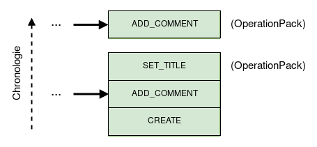
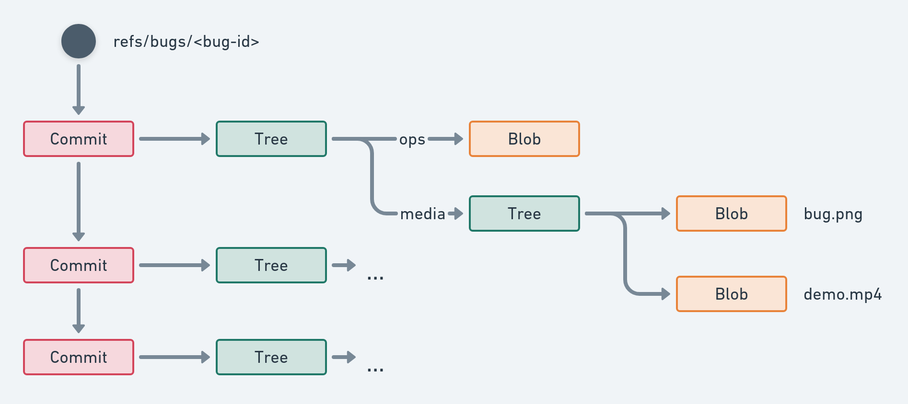
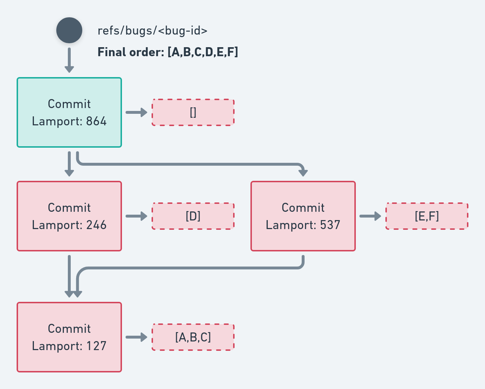
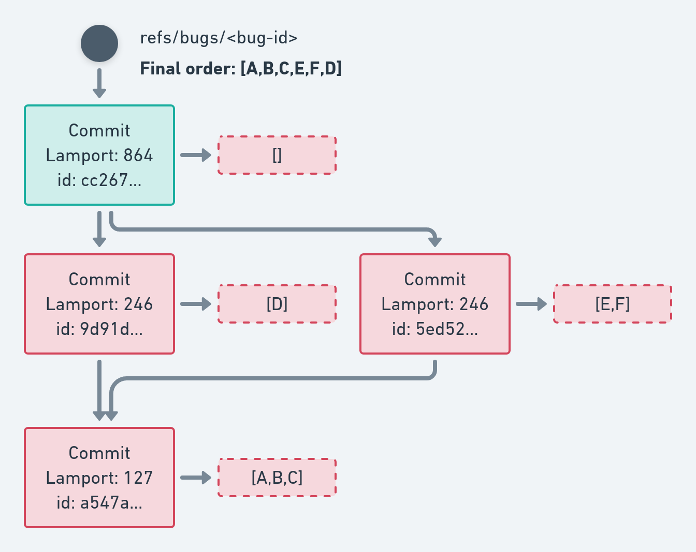

Entities data model
===================

If you are not familiar with [git internals](https://git-scm.com/book/en/v1/Git-Internals), you might first want to read about them, as the `git-bug` data model is built on top of them.

## Entities (bugs, ...) are a series of edit operations

As entities are stored and edited in multiple process at the same time, it's not possible to store the current state like it would be done in a normal application. If two process change the same entity and later try to merge the states, we wouldn't know which change takes precedence or how to merge those states.

To deal with this problem, you need a way to merge these changes in a meaningful way. Instead of storing the final bug data directly, we store a series of edit `Operation`s. This is a common idea, notably with [Operation-based CRDTs](https://en.wikipedia.org/wiki/Conflict-free_replicated_data_type#Operation-based_CRDTs).



To get the final state of an entity, we apply these `Operation`s in the correct order on an empty state to compute ("compile") our view. 

## Entities are stored in git objects

An `Operation` is a piece of data including:

- a type identifier
- an author (a reference to another entity)
- a timestamp (there is also 1 or 2 Lamport time that we will describe later)
- all the data required by that operation type (a message, a status ...)
- a random nonce to ensure we have enough entropy, as the operation identifier is a hash of that data (more on that later)

These `Operation`s are aggregated in an `OperationPack`, a simple array. An `OperationPack` represents an edit session of a bug. As the operation's author is the same for all the `OperationPack` we only store it once. 

We store this pack in git as a git `Blob`; that consists of a string containing a JSON array of operations. One such pack -- here with two operations -- might look like this:

```json
{
  "author": {
    "id": "04bf6c1a69bb8e9679644874c85f82e337b40d92df9d8d4176f1c5e5c6627058"
  },
  "ops": [
    {
      "type": 3,
      "timestamp": 1647377254,
      "nonce": "SRQwUWTJCXAmQBIS+1ctKgOcbF0=",
      "message": "Adding a comment",
      "files": null
    },
    {
      "type": 4,
      "timestamp": 1647377257,
      "nonce": "la/HaRPMvD77/cJSJOUzKWuJdY8=",
      "status": 1
    }
  ]
}
```

To reference our `OperationPack`, we create a git `Tree`; it references our `OperationPack` `Blob` under `"/ops"`. If any edit operation includes a media (for instance in a message), we can store that media as a `Blob` and reference it here under `"/media"`.

To complete the picture, we create a git `Commit` that references our `Tree`. Each time we add more `Operation`s to our bug, we add a new `Commit` with the same data-structure to form a chain of `Commit`s.

This chain of `Commit`s is made available as a git `Reference` under `refs/bugs/<bug-id>`. We can later use this reference to push our data to a git remote. As git will push any data needed as well, everything will be pushed to the remote, including the media.

Here is the complete picture:



## Time is unreliable

It would be very tempting to use the `Operation`'s timestamp to give us the order to compile the final state. However, you can't rely on the time provided by other people (their clock might be off) for anything other than just display. This is a fundamental limitation of distributed system, and even more so when actors might want to game the system.

Instead, we are going to use [Lamport logical clock](https://en.wikipedia.org/wiki/Lamport_timestamps). A Lamport clock is a simple counter of events. This logical clock gives us a partial ordering:

- if L1 < L2, L1 happened before L2
- if L1 > L2, L1 happened after L2
- if L1 == L2, we can't tell which happened first: it's a concurrent edition


Each time we are appending something to the data (create an Entity, add an `Operation`) a logical time will be attached, with the highest time value we are aware of plus one. This declares a causality in the event and allows ordering entities and operations.

The first commit of an Entity will have both a creation time and edit time clock, while a later commit will only have an edit time clock. These clocks value are serialized directly in the `Tree` entry name (for example: `"create-clock-4"`). As a Tree entry needs to reference something, we reference the git `Blob` with an empty content. As all of these entries will reference the same `Blob`, no network transfer is needed as long as you already have any entity in your repository.

Example of Tree of the first commit of an entity:
```
100644 blob e69de29bb2d1d6434b8b29ae775ad8c2e48c5391	create-clock-14
100644 blob e69de29bb2d1d6434b8b29ae775ad8c2e48c5391	edit-clock-137
100644 blob a020a85baa788e12699a4d83dd735578f0d78c75	ops
```
Note that both `"ops"` and `"root"` entry reference the same OperationPack as it's the first commit in the chain.

Example of Tree of a later commit of an entity:
```
100644 blob e69de29bb2d1d6434b8b29ae775ad8c2e48c5391	edit-clock-154
100644 blob 68383346c1a9503f28eec888efd300e9fc179ca0	ops
```

## Entities and Operation's ID

`Operation`s can be referenced in the data model or by users with an identifier. This identifier is computed from the `Operation`'s data itself, with a hash of that data: `id = hash(json(op))`

For entities, `git-bug` uses as identifier the hash of the first `Operation` of the entity, as serialized on disk.

The same way as git does, this hash is displayed truncated to a 7 characters string to a human user. Note that when specifying a bug id in a command, you can enter as few characters as you want, as long as there is no ambiguity. If multiple entities match your prefix, `git-bug` will complain and display the potential matches.

## Entities support conflict resolution

Now that we have all that, we can finally merge our entities without conflict and collaborate with other users. Let's start by getting rid of two simple scenario:

- if we simply pull updates, we move forward our local reference. We get an update of our graph that we read as usual.
- if we push fast-forward updates, we move forward the remote reference and other users can update their reference as well.

The tricky part happens when we have concurrent edition. If we pull updates while we have local changes (non-straightforward in git term), git-bug create the equivalent of a merge commit to merge both branches into a DAG. This DAG has a single root containing the first operation, but can have branches that get merged back into a single head pointed by the reference.

As we don't have a purely linear series of commits/`Operations`s, we need a deterministic ordering to always apply operations in the same order.

git-bug apply the following algorithm:

1. load and read all the commits and the associated `OperationPack`s
2. make sure that the Lamport clocks respect the DAG structure: a parent commit/`OperationPack` (that is, towards the head) cannot have a clock that is higher or equal than its direct child. If such a problem happen, the commit is refused/discarded.
3. individual `Operation`s are assembled together and ordered given the following priorities:
   1. the edition's lamport clock if not concurrent
   2. the lexicographic order of the `OperationPack`'s identifier

Step 2 is providing and enforcing a constraint over the `Operation`'s logical clocks. What that means is that we inherit the implicit ordering given by the DAG. Later, logical clocks refine that ordering. This, coupled with signed commit has the nice property of limiting how this data model can be abused.

Here is an example of such an ordering. We can see that:

- Lamport clocks respect the DAG structure
- the final `Operation` order is [A,B,C,D,E,F], according to those clocks



When we have a concurrent edition, we apply a secondary ordering based on the `OperationPack`'s identifier:



This secondary ordering doesn't carry much meaning, but it's unbiased and hard to abuse.
