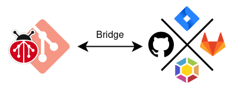

# Using bridges<a name="using-bridges"></a>

This page provides an overview of how to use _bridges_ to sync issues to and
from third-party platforms.

<!-- mdformat-toc start --slug=github --maxlevel=4 --minlevel=2 -->

- [Overview](#overview)
- [Supported bridges](#supported-bridges)
- [Getting started](#getting-started)
- [Interacting with the bridge](#interacting-with-the-bridge)

<!-- mdformat-toc end -->

## Overview<a name="overview"></a>

Bridges within `git-bug` are bi-directional, incremental, and speedy gateways to
third-party platforms. Configuring a bridge allows you to push and pull issues
to and from a third party platform.

This expands the utility and function of `git-bug`: because issues are just
objects in your git repository, you can import issues from a bridge to work on
them in bulk, offline, in your preferred environment, at your own pace. When
you're ready to push your issues back to the external platform again, you'll be
able to synchronize the changes you made with one simple command.

<p align="center">
    
</p>

This has several benefits:

- works offline, including edition
- browsing is pretty much instant
- you get to choose the UI you prefer between CLI, interactive terminal UI or
  web UI
- you have a near-complete archive of issues locally, embedded in your git
  repository, in case the external platform becomes inaccessible
- you are free to move to another platform -- your issues follow wherever your
  repo goes!

## Supported bridges<a name="supported-bridges"></a>

We support a number of bridges:

- Jira
- GitHub
- GitLab
- Launchpad

_For a full list of the features enabled for each bridge, see the
[feature matrix][docs/feature-matrix]._

## Getting started<a name="getting-started"></a>

1. From within a git repository, run `git bug bridge configure` to start the
   configuration wizard
2. Choose the type of bridge you want to configure, e.g. `github`
3. Type a name for the bridge configuration. As you can configure multiple
   bridges, this name will allow you to choose when there is an ambiguity.
4. If you already have a repository created on the external platform, and your
   local git repository has that as a remote, the configuration wizard will
   automatically detect the URL. Otherwise, please ensure you enter the
   appropriate URL for the remote project: something like
   `https://github.com/git-bug/git-bug`
5. Create an access token. You can either use the interactive token creation,
   enter it on your own token, or use an existing token if you already have one

That's it! Once you've completed the wizard, you'll have successfully configured
a bridge.

## Interacting with the bridge<a name="interacting-with-the-bridge"></a>

To push issues out to the bridge, run:

```bash
git bug bridge push [NAME]
```

To pull and integrate updates for issues from the bridge:

```bash
git bug bridge pull [NAME]
```

> [!TIP]
> See the [CLI documentation][doc/cli/bridge] for more information on the
> command line arguments and options.

The command line is primarily meant for programmatic usage or to interface with
`git-bug` with scripts or other tools. For day to day usage, we recommend taking
a look at \[the supported interfaces\]\[interfaces\], which include a robust TUI
and an in-progress Web UI.

______________________________________________________________________

##### See more

- [A bird's-eye view of the internal architecture][docs/design/arch]
- [A description of the data model][docs/design/model]
- [An overview of the native interfaces][docs/usage/interfaces]
- [Filtering query results][docs/usage/filter]
- [Understanding the workflow models][docs/usage/workflows]
- :house: [Documentation home][docs/home]

[doc/cli/bridge]: ../md/git-bug_bridge.md
[docs/design/arch]: ../design/architecture.md
[docs/design/model]: ../design/data-model.md
[docs/feature-matrix]: ../feature-matrix.md
[docs/home]: ../README.md
[docs/usage/filter]: ./query-language.md
[docs/usage/interfaces]: ./interfaces.md
[docs/usage/workflows]: ./workflows.md
