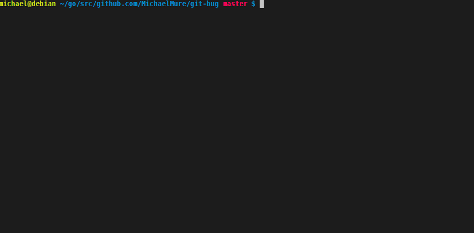
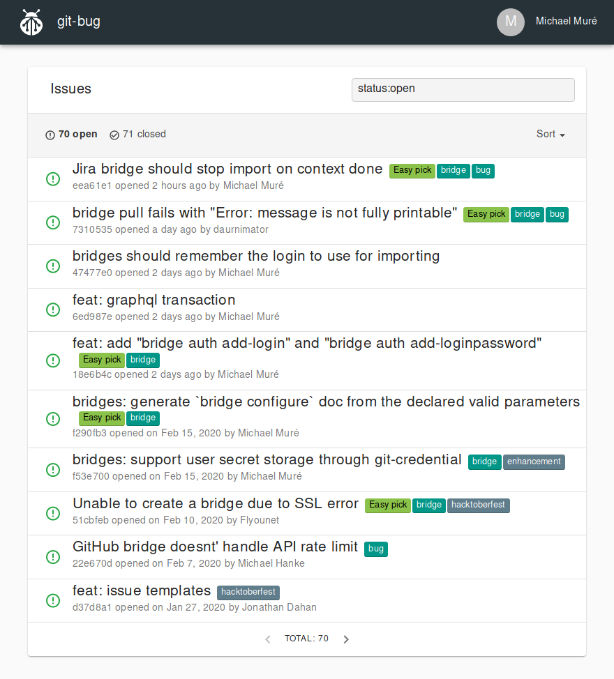
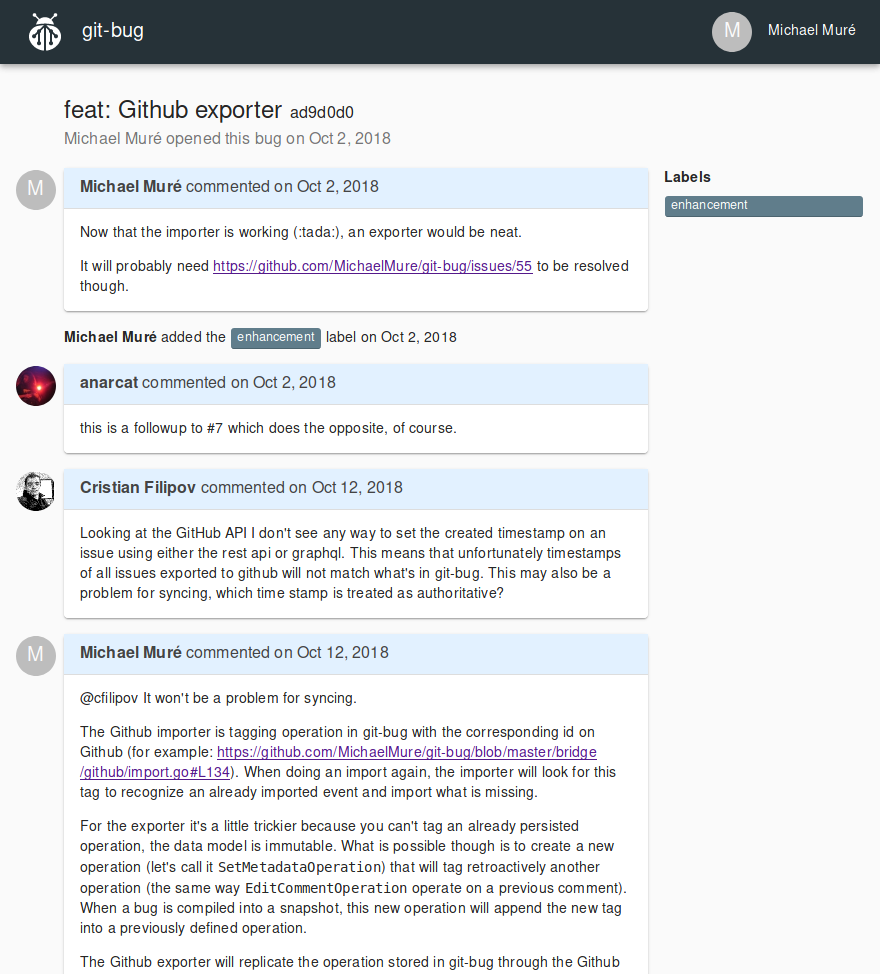

# Native interfaces

This page provides an overview of the different interfaces `git-bug` supports.

<!-- mdformat-toc start --slug=github --maxlevel=4 --minlevel=2 -->

- [TUI](#tui)
- [Web UI](#web-ui)

<!-- mdformat-toc end -->

## TUI

The integrated TUI (text-based user interface) is the recommended way to
interface with `git-bug` issues in your repository.

To start it, run `git bug termui` in your terminal.

## Web UI

The web UI is packed inside the same binary and serves static content through an
http server running on the local machine. The frontend interacts with the
backend through a GraphQL API. [View the schema][gql-schema] for more
information.

To serve the website locally, run `git bug webui` in your terminal.

> [!NOTE]
> The web interface is alpha-level software and does not support all of the
> features of `git-bug`. We recommend using the TUI for most day-to-day
> operations at the moment.

<strong>View the issue feed</strong>

 

<strong>View the discussion for an issue</strong>

______________________________________________________________________

##### See more

- [Filtering query results][docs/usage/filter]
- [How to use bridges][docs/usage/bridges]
- [Understanding the workflow models][docs/usage/workflows]
- :house: [Documentation home][docs/home]

[docs/home]: ../README.md
[docs/usage/bridges]: ./third-party.md
[docs/usage/filter]: ./query-language.md
[docs/usage/workflows]: ./workflows.md
[gql-schema]: ../../api/graphql/schema
