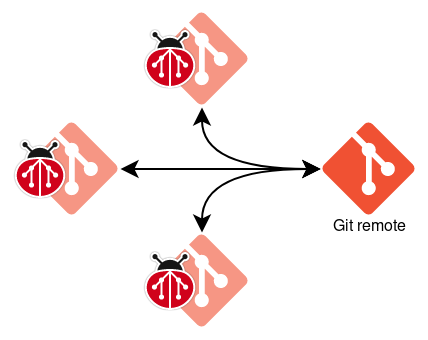
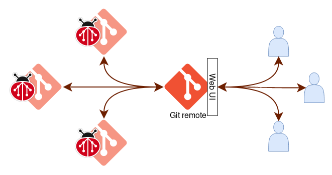

# Workflows

This document provides an overview of different workflows that `git-bug`
supports.

<!-- mdformat-start --slug=github --maxlevel=4 --minlevel=2 -->

## Native workflow

    

This is the pure `git-bug` experience. In a similar fashion as with code, use
`git bug push` and `git bug pull` to push and pull your bugs between git remotes
and collaborate with your teammate.

_Recommended reading: [CLI documentation][docs/cli]_

## Bridge workflow

    

`git-bug` supports syncing issues with third-party platforms, such as GitHub,
GitLab, and Jira. This lets you work on issues offline, editing issues in bulk
with your preferred editor, or to build an archive of any project's issues --
it's up to you!

_Recommended reading: [How to use bridges][docs/usage/bridges]_

## Web UI workflow

    

> [!NOTE]
> The web UI is a work in progress, and is not feature-complete. To utilize
> `git-bug` to its full potential, we recommend using the TUI or CLI.

Often, projects needs to have their bug-tracker public and accept editions from
anyone facing a problem. To support this workflow, `git-bug` aims to have the
web UI accept external OAuth authentication and act as a public portal. However
the web UI is not up to speed for that yet. Contributions are very much welcome!

______________________________________________________________________

##### See also

- [CLI documentation][docs/cli]
- [Filtering query results][docs/usage/filter]
- [How to use bridges][docs/usage/bridges]
- [Learn about the native interfaces][docs/usage/interfaces]
- :house: [Documentation home][docs/home]

[docs/cli]: ../md/git-bug.md
[docs/home]: ../README.md
[docs/usage/bridges]: ./third-party.md
[docs/usage/filter]: ./query-language.md
[docs/usage/interfaces]: ./interfaces.md
