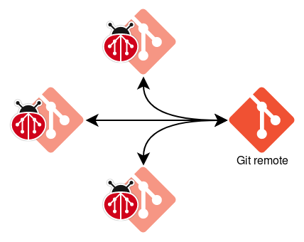
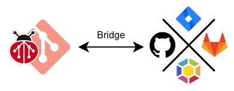
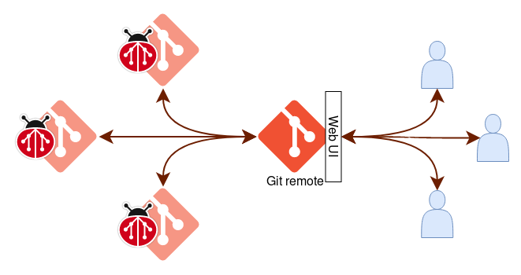

# Workflows

This document provides an overview of different workflows that `git-bug`
supports.

## Native workflow

    

This is the pure `git-bug` experience. In a similar fashion as with code, use
`git bug push` and `git bug pull` to push and pull your bugs between git remotes
and collaborate with your teammate.

## Bridge workflow

    

As `git-bug` has bridges with other bug-trackers, you can use it as your
personal local remote interface. Sync with `git bug bridge pull` and
`git bug bridge push`, work from your terminal, integrate into your editor, it's
up to you. And it works offline!

## Web UI workflow

    

> [!NOTE]
> The web UI is a work in progress, and is not feature-complete. To utilize
> `git-bug` to its full potential, we recommend using the CLI.

Often, projects needs to have their bug-tracker public and accept editions from
anyone facing a problem. To support this workflow, `git-bug` aims to have the
web UI accept external OAuth authentication and act as a public portal. However
the web UI is not up to speed for that yet. Contributions are very much welcome!
